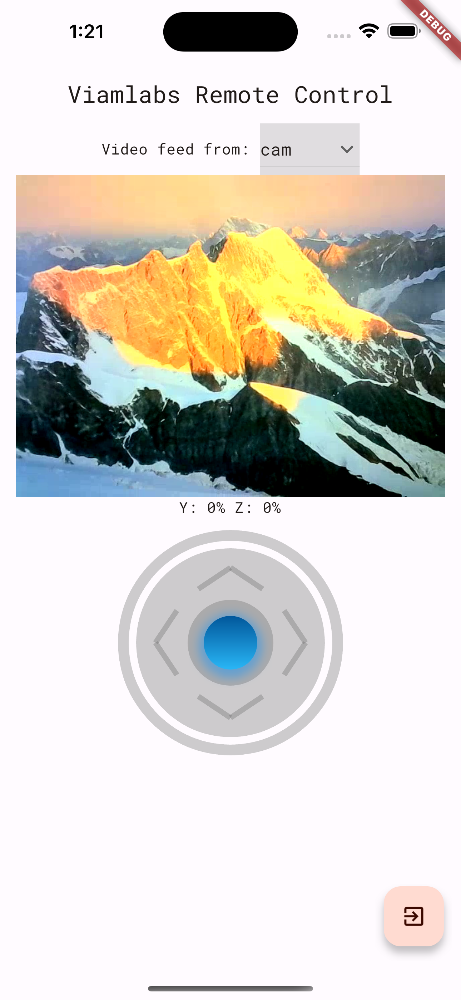

# Viamlabs - Remote Control

> [!WARNING]
> This repo has moved to [viam-soleng](https://github.com/viam-soleng/viam-remote-control) and this one here won't be maintained.
> 



This repo contains a simple demo application to demonstrate how easy it is to build mobile apps such as remote control of robots, using the Viam Flutter SDK. This code is kept as simple as possible to also allow people who are not yet familiar with Flutter get started easily.
If you are new to Flutter, we highly recommend to start with one of the many tutorials and courses out there such as on [Flutter.dev](https://docs.flutter.dev/). This course also helps you with the setup/prerequisits to install your development environment and start the application.

The app code is ready to use and if you don't have a robot at hand, feel free to rent one for free here at [Viam.com](https://www.viam.com/resources/try-viam).

Please keep in mind that this is no production ready code and purely for educational purposes!

If you have any questions please don't hesitate to reach out via [Viam Community](https://www.viam.com/resources/community).

## Features (besides the obvious ones)

While you can enter the robot credentials every time you connect to the robot, this is not very developer friendly.
To automatically prepopulate the credentials you can create a ```.env``` file at the level of this README.md file.

Add the following text:

```
LOCATION= <--e.g. rover.xyz123.viam.cloud-->
SECRET= <--Location Secret-->
```
You can get the credentials from the [app.viam.com](app.viam.com) under the ```code sample``` tab.
